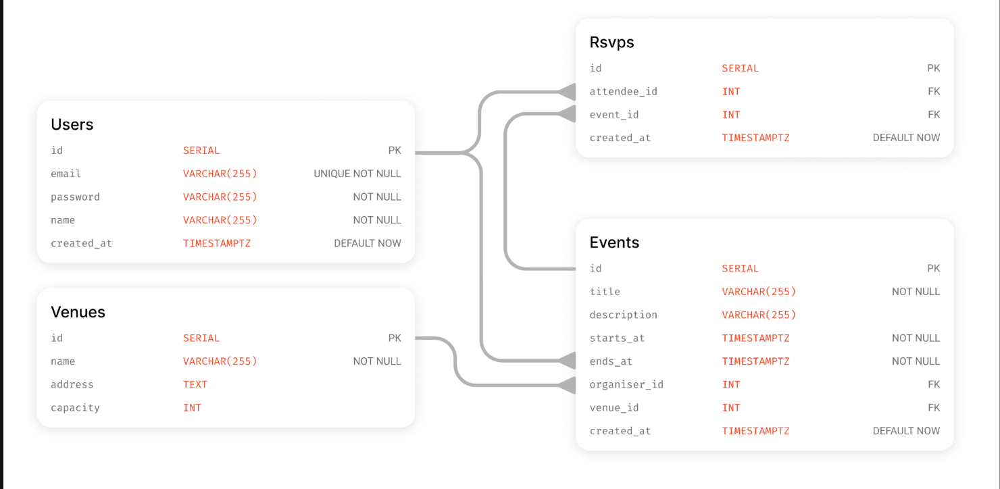

# NC Plus One
## Overview

NC Plus One is an event management application developed as part of the Northcoders Data Engineering, AI & Machine Learning Bootcamp.

The project explores modern software engineering and data engineering practices by modelling an event management platform using a relational PostgreSQL database and exposing data through a RESTful API built with FastAPI. As the project develops, it will continue to evolve with additional functionality and technologies introduced throughout the bootcamp, providing an end-to-end application for exploring database design, API development, authentication, testing and modern engineering practices.

Current Features
Relational PostgreSQL database designed from an Entity Relationship Diagram (ERD)
Automated database creation and seeding using Python
RESTful API built with FastAPI
SQL joins to retrieve related event and venue data
Integration testing with pytest
Git feature branch workflow
Current API Endpoints
Method	Endpoint	Description
GET	/api/events	Returns a list of all events with venue information
GET	/api/events/{event_id}	Returns detailed information for a specific event
Currently In Development
JWT authentication
Secure password hashing using bcrypt
User registration and login
Protected endpoints
RSVP functionality
Additional CRUD operations
Technologies
Python
PostgreSQL
SQL
FastAPI
Git
pytest
JWT (in progress)
bcrypt (in progress)
Database Design

The database has been designed using relational modelling principles and normalisation techniques. Relationships between entities are enforced using primary and foreign keys.

  

Running the Project
Database Setup

Create a fresh local database:

psql -d postgres -f db/setup.sql
Database Credentials

Create a credentials.py file containing your local PostgreSQL credentials.

This file is excluded from version control and should not be committed.
