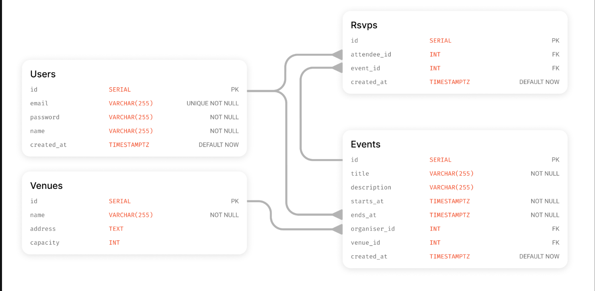

# NC Plus One

## Overview

The project explores modern software engineering and data engineering practices by modelling an event management platform using a relational PostgreSQL database, exposing data through a RESTful FastAPI application, and provisioning cloud infrastructure with Terraform on AWS. As the project develops, additional features and deployment automation will continue to be introduced, providing an end-to-end platform for exploring database design, API development, cloud infrastructure, authentication, testing and modern engineering practices.

---

## Current Features

- Relational PostgreSQL database designed from an Entity Relationship Diagram (ERD)
- Automated database creation and seeding using Python
- RESTful API built with FastAPI
- User registration with secure password hashing using bcrypt
- User authentication using JWT bearer tokens
- Protected API endpoints using FastAPI dependency injection
- Event RSVP endpoint for authenticated users
- SQL joins to retrieve related event and venue data
- Integration testing with pytest
- Infrastructure provisioned with Terraform
- Remote Terraform state stored in Amazon S3
- Automated deployment of the FastAPI application to Amazon EC2
- Private PostgreSQL database hosted on Amazon RDS
- Remote database seeding from the deployed EC2 instance
- Application health check endpoint (`GET /api/health`)

---

## Currently in Development

RSVP cancellation
Event creation, editing and management
Organiser-only endpoints and authorisation
Event attendee management
CI/CD pipeline for automated infrastructure and application deployment
Infrastructure monitoring and logging

---

## Technologies

| Technology | Version | Purpose |
|------------|---------|---------|
| Python | 3.14 | Programming language |
| PostgreSQL | 17 | Relational database |
| FastAPI | 0.138.0 | REST API framework |
| Uvicorn | 0.49.0 | ASGI server |
| psycopg2 | 2.9.12 | PostgreSQL database adapter |
| pytest | 9.1.1 | Integration testing |
| PyJWT | 2.13.0 | JSON Web Token authentication |
| bcrypt | 5.0.0 | Password hashing |
| python-dotenv | 1.2.2 | Environment variable management |
| httpx2 | 2.4.0 | HTTP client for API testing |

---

## Installation

Clone the repository and navigate into the project directory:

```bash
git clone <repository-url>
cd nc-plus-one
```

---

### Installing Python Dependencies

Install all required Python packages inside a virtual environment:

```bash
python3 -m venv .venv
source .venv/bin/activate
python -m pip install -r requirements.txt
```

---

## Environment Configuration

This project uses environment variables to configure the PostgreSQL connection and JWT authentication.

1. Copy the example configuration:

```bash
cp .env.example .env
```

2. Update `.env` with your local PostgreSQL and JWT values:

```text
PGHOST=
PGPORT=
PGDATABASE=
PGUSER=
PGPASSWORD=
JWT_SECRET=
```

| Variable | Description |
|----------|-------------|
| `PGHOST` | PostgreSQL server hostname |
| `PGPORT` | PostgreSQL server port |
| `PGDATABASE` | PostgreSQL database name |
| `PGUSER` | PostgreSQL username |
| `PGPASSWORD` | PostgreSQL password |
| `JWT_SECRET` | Secret used to sign JWTs |

> `.env.example` contains the required variable names only and can be safely committed to the repository. Your `.env` file contains your local configuration and must **not** be committed.

---
## Infrastructure

### Terraform

Terraform stores its state remotely in an S3 backend.

#### Bootstrap the backend

1. Create a globally unique S3 bucket to store the Terraform state.
2. Update `terraform/backend.tf` with your bucket name.
3. Ensure the bucket exists before running:

```bash
terraform -chdir=terraform init
```

Terraform will configure the S3 backend and use it to store the project's state.

### EC2

Terraform provisions an Amazon EC2 instance using:

- Instance type: `t2.micro`
- Operating system: Latest Ubuntu Server LTS (selected dynamically using the Terraform `aws_ami` data source)

### RDS PostgreSQL

Terraform provisions a private PostgreSQL RDS instance using:

- **Instance class:** `db.t4g.micro`
- **Allocated storage:** `20 GiB`
- **Public access:** disabled
- **Database port:** `5432`
- **Network access:** permitted only from the EC2 application security group

Database credentials are supplied through a local, gitignored
`terraform.tfvars` file and are not committed to the repository.

### Seeding the Remote Database

The application connects to PostgreSQL using the following environment variables, which must be configured before running the seed script:

```text
PGHOST
PGPORT
PGDATABASE
PGUSER
PGPASSWORD
```

From a machine with network access to the private RDS instance (such as the deployed EC2 instance), activate the project's virtual environment and run:

```bash
export PYTHONPATH=$PWD

source .venv/bin/activate
python db/seed.py
```

After seeding, verify the deployed API is serving data from the remote database:

```text
http://<ec2-public-ip>:8000/api/events
```
## Deployment

After completing the infrastructure prerequisites described above:

1. Provision the infrastructure:

```bash
terraform -chdir=terraform apply
```

2. Retrieve the Terraform outputs:

```bash
terraform -chdir=terraform output
```

3. SSH to the EC2 instance using the public IP output and wait for the deployment to complete

4. Before running the seed script, configure the PostgreSQL environment variables in the current SSH session using:
   - the RDS endpoint and port from the Terraform outputs;
   - the database username and password stored in the local, gitignored `terraform.tfvars` file.

5. Activate the virtual environment and seed the remote database:

```bash
cd ~/nc-plus-one

export PYTHONPATH=$PWD

source .venv/bin/activate
python db/seed.py
```

6. Verify the deployment from your local machine:

```bash
curl "http://$(terraform -chdir=terraform output -raw instance_public_ip):8000/api/health"

curl "http://$(terraform -chdir=terraform output -raw instance_public_ip):8000/api/events"
```

7. Destroy the infrastructure when no longer required:

```bash
terraform -chdir=terraform destroy
```

---
## Database Design

The database has been designed using relational modelling principles and normalisation techniques. Relationships between entities are enforced using primary and foreign keys.

<p align="center">
  
</p>

---
## Local Database Setup & Seeding

These steps are intended for **local development** using a locally hosted PostgreSQL database.

Create and seed the local database:

```bash
psql -d postgres -f db/setup.sql
python db/seed.py
```

The seed script tears down any existing tables before recreating and repopulating the database.

> To seed the **remote RDS** instance, follow the instructions in the **Infrastructure → Seeding the Remote Database** section.

## Running the API

Start the FastAPI development server:

```bash
uvicorn main:app --reload
```

Once the server is running, the API will be available at:

```text
http://127.0.0.1:8000
```

Interactive API documentation can be accessed at:

- Swagger UI: http://127.0.0.1:8000/docs
- ReDoc: http://127.0.0.1:8000/redoc


## Running Tests

Run the full integration test suite:

```bash
PYTHONPATH=$PWD pytest
```
